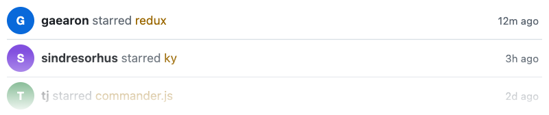

# StarCards

<h3 align="center"></h3>

<h3 align="center"></h3>

<p align="center">
  <a href="#about">About</a> •
  <a href="#features">Features</a> •
  <a href="#quick-start--information">Quick Start & Information</a>
</p>

## About
[](https://github.com/SegoCode/StarCards)
[](https://github.com/SegoCode/StarCards)
[](https://github.com/SegoCode/StarCards/graphs/commit-activity)
[](https://github.com/SegoCode/StarCards/blob/main/LICENSE)
[](https://github.com/SegoCode/SegoCode/discussions/2)

StarCards is a Cloudflare Worker that returns an SVG of the latest GitHub stars on your repositories. You deploy your own instance, then embed that URL in markdown.

## Features

- Card layout by default, feed layout with `layout=feed`
- `width` sets the SVG size; `cards` sets how many rows (default 3)
- The service inlines each avatar in the SVG
- Cloudflare caches the image for one hour

## Quick Start & Information

Set `OWNER` in `code/src/github.ts` to your GitHub username. From `code/`:

```
pnpm install
pnpm deploy
```

Wrangler prints a `*.workers.dev` URL. Embed it:

```

```

```
.workers.dev/?width=640">
```

```

```

> [!NOTE]
> Point `OWNER` at your GitHub user before you deploy. Cloudflare caches each URL for one hour.

### Available Parameters

```
https://starcards.<subdomain>.workers.dev/?width=640
```
*Required. SVG width in pixels, a positive integer.*

```
https://starcards.<subdomain>.workers.dev/?width=640&cards=5
```
*How many star rows to draw. Defaults to 3.*

```
https://starcards.<subdomain>.workers.dev/?width=640&layout=feed
```
*`card` (default) or `feed`.*

---
<p align="center"><a href="https://github.com/SegoCode/StarCards/graphs/contributors">
  
</a></p>
