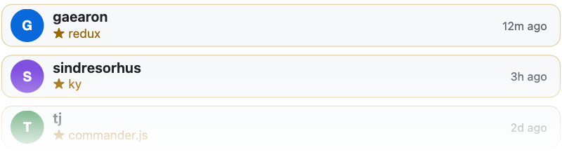

# StarCards

<h3 align="center"></h3>

<p align="center">
  <a href="#about">About</a> •
  <a href="#features">Features</a> •
  <a href="#quick-start--information">Quick Start & Information</a>
</p>

## About
[](https://github.com/SegoCode/StarCards)
[](https://github.com/SegoCode/StarCards)
[](https://github.com/SegoCode/StarCards/graphs/commit-activity)
[](https://github.com/SegoCode/StarCards/blob/main/LICENSE)
[](https://github.com/SegoCode/SegoCode/discussions/2)

StarCards is a Cloudflare Worker that returns an SVG of the latest GitHub stars on your repositories. You deploy your own instance, then embed that URL in markdown.

## Features

- SVG built for GitHub READMEs
- Two layouts: stacked cards or a star feed
- Inlined GitHub avatars
- Cloudflare caches the SVG at the edge

## Quick Start & Information

Set `OWNER` in `code/src/github.ts` to your GitHub username. From `code/`:

```
pnpm install
pnpm deploy
```

Wrangler prints a `*.workers.dev` URL. Embed it:

```

```

```
.workers.dev/?width=640">
```

```

```

> [!NOTE]
> Point `OWNER` at your GitHub user before you deploy. Cloudflare caches each URL for one hour.

### Available Parameters

Query string on the worker URL. Unknown names are ignored.

```
https://starcards.<subdomain>.workers.dev/?width=640
```
*`width` (required). SVG width in pixels. Must be a positive integer (for example `640`). Height follows the layout and the number of rows. Missing, `0`, or any non-integer returns HTTP 400 with `width must be a positive integer`.*

```
https://starcards.<subdomain>.workers.dev/?width=640&cards=5
```
*`cards` (optional). How many star rows to draw. Must be a positive integer. Omit it and the worker draws 3. Invalid values return HTTP 400 with `cards must be a positive integer`.*

```
https://starcards.<subdomain>.workers.dev/?width=640&layout=feed
```
*`layout` (optional). `card` or `feed`. Omit it or pass `card` for stacked cards (login, starred repo, time). `feed` draws one line per event: `login starred repo`. Any other value returns HTTP 400 with `layout must be card or feed`.*

---
<p align="center"><a href="https://github.com/SegoCode/StarCards/graphs/contributors">
  
</a></p>
